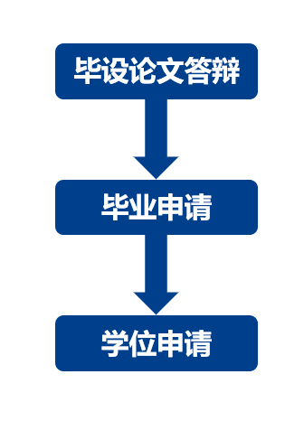

# 自考毕业论文流程：

流程主要分为：毕设论文答辩、毕业申请、学位申请，三个部分。三者是递进的关系，前一个部分完成后一个部分才能开启。



（这里是北邮本科计算机系的，其他学校也大致相同）

# 毕设论文答辩

个人建议大家先做毕设再做论文，也可以先写一部分论文在做毕设

（毕设论文中有我的个人信息，希望大家不要随意泄露）

### 具体过程：

| 程序         | 时间               | 时间               |                                                       |
| ------------ | ------------------ | ------------------ | ----------------------------------------------------- |
| 1.论文申报   | 自考成绩公布后几天 | 自考成绩公布后几天 |                                                       |
| 2.任务书提交 | 6.18               | 12.20              |                                                       |
| 3.论文查重   | 9.6--9.18          | 3.2--3.21          | （维普论文检测系统，重复率25%以下，具体请看官网通知） |
| 4.提交论文   | 9.20               | 3.21               |                                                       |
| 5.论文答辩   | 10.25-- 10.27左右  | 4.3-4.11左右       |                                                       |

时间仅供参考，具体以官网为准

### 毕设

可以自己做，也可以通过其他方式

我的毕设是基于若依开发的，网址（http://dreamsbishe.ypfblog.com/），可以借鉴

角色有三种，我的ppt和论文中都有介绍。

账号：sys001，work001，stu001

密码：都是123456

（希望不要随意修改数据）

### 论文

参考论文推荐去知网找

论文内容和要求可以多看看毕业设计的指导，里面对内容和格式有比较具体的要求，在通知文件中

### 答辩

答辩时有摄像头录像，是用笔记本摄像头将答辩人和投影仪画面一起录下（我答辩时是这样）

**提问问题**：从答辩开始，老师就会问一些问题，提问时间问的问题会更多。

**提问内容**：提问内容主要是与毕设和论文相关的，比如论文中包含数据流图，会问数据流图包含哪些部分，读一些毕设代码，以及功能如何实现的。

### 相应资料：

毕业论文word、ppt相关操作知识：https://www.bilibili.com/video/BV1U5411H7UA?p=1&vd_source=3b303526b5cb022d1d78076c28e7d2a4

PPT模板下载：https://www.officeplus.cn/

论文电子签名：可以去哔站上搜，好多内容在上面都可以找到


# 毕业申请 

### 具体过程：

| 程序       | 时间               | 时间               |                            |
| ---------- | ------------------ | ------------------ | -------------------------- |
| 1.毕业申报 | 自考成绩公布后几天 | 自考成绩公布后几天 |                            |
| 2.照片采集 | 12.12              | 6.10               |                            |
| 3.照片复审 | 12.19              | 6.15               |                            |
| 4.学历注册 | 1月中旬            | 7.10               |                            |
| 5.证书发放 | 2.23左右           | 9.15左右           | (根据区县不同时间有所不同) |

时间仅供参考，具体以官网为准

# 学位申请

### 具体过程：

| 程序       | 时间 | 时间 |                |
| ---------- | ---- | ---- | -------------- |
| 1.学位申报 | 3.17 | 9.17 |                |
| 2.照片采集 | 3.21 | 9.21 |                |
| 3.证书发放 | 7.4  | 3.2  | （由学校发放） |


时间仅供参考，具体以官网为准

# 总结

总之，无论怎样都希望各位同学、校友顺利毕业，拿到自己的毕业证和学位证。漫漫尘世相遇及是缘分，自考不是一条很轻松的路，相信各位走到这里都不容易，所以我将自己的一点经验分享给大家，希望大家可以顺利毕业！最后我还想说一句，希望毕业之后大家可以成为朋友，相互扶持，相互帮助，这里借用古人的一句话，**苟富贵勿相忘**。


```
		自考
白藤纸，黑墨笔，沙沙齐鸣深夜吟
长歌起，戍相送，宝剑是从磨砺出
跨马西乘千里沃，斗战干将西昆仑
莫使人来闲乘雪，今时不忘来回与
```

# 资源扩展

**Flat. 同学提供**

